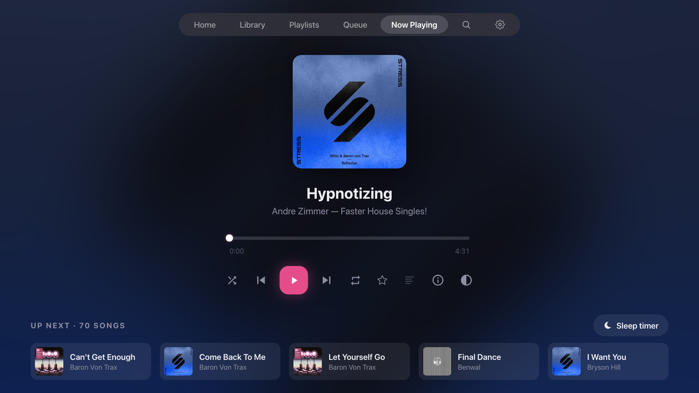
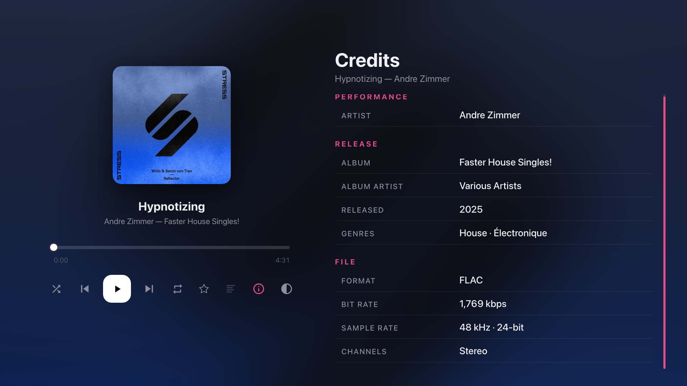
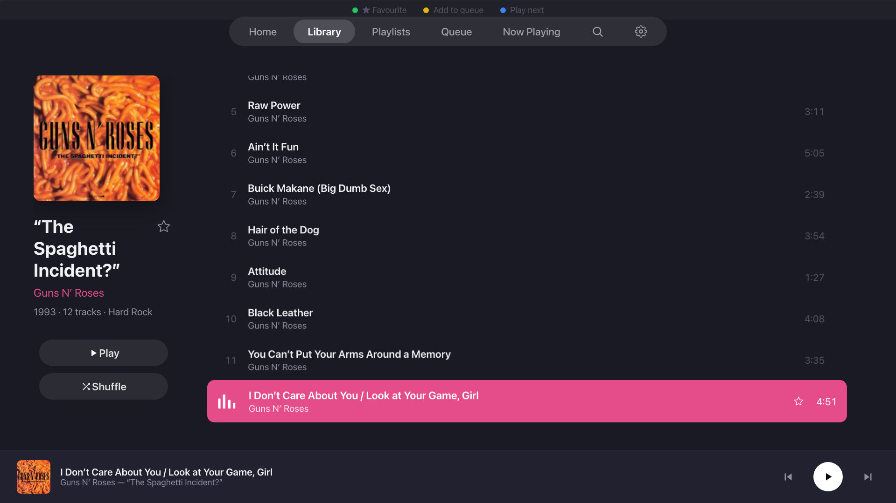
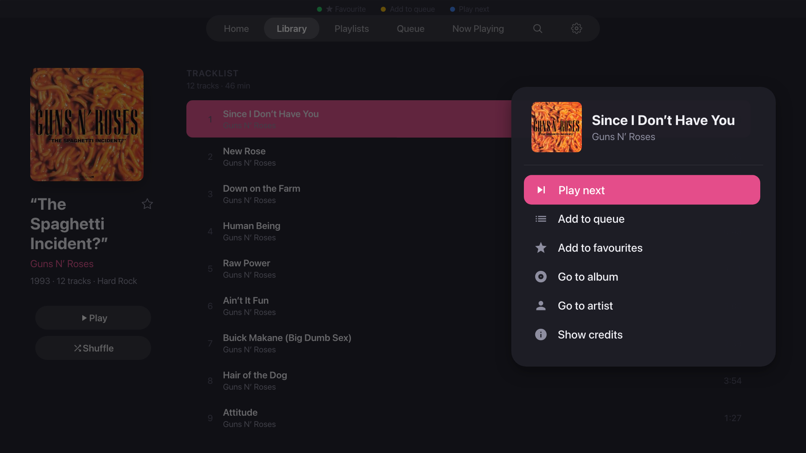
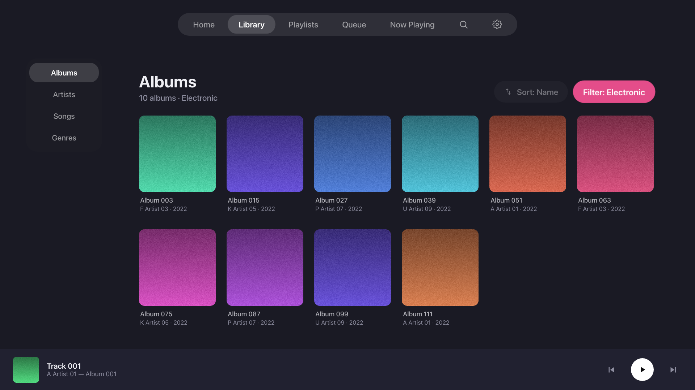
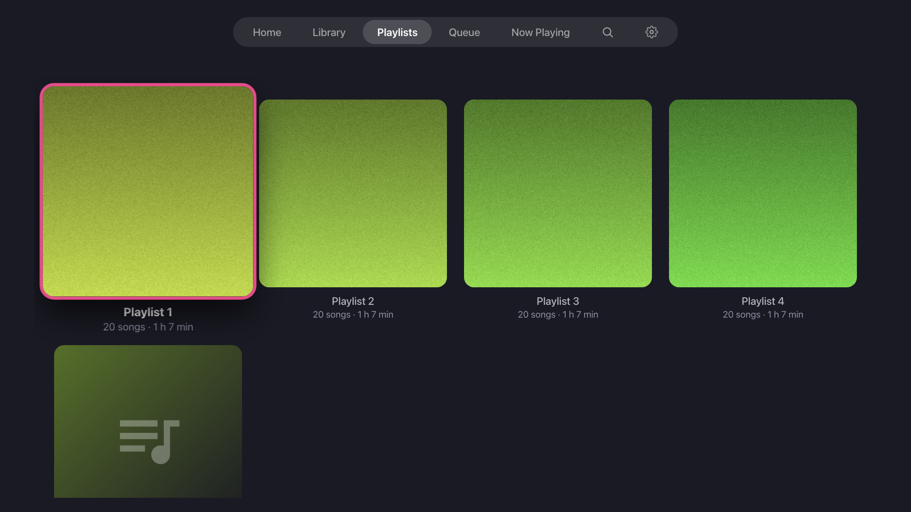

# Sonance

**A music player for Samsung Tizen TVs, built to stream from your self-hosted Navidrome or Subsonic-compatible server.**



Sonance turns your Samsung smart TV into a full-featured music player. Browse your library, play albums, search your collection, and enjoy synced lyrics — all from your sofa with just the TV remote.

This is Version 3 of Sonance — a UI rewrite with a completely new hardware-accelerated interface and multiple library support. **Version 3.11** made it readable and responsive from the sofa: a larger, adjustable interface, a clear focus highlight, faster navigation, and a much richer Now Playing screen. See [CHANGELOG-3.9 to 3.11.md](CHANGELOG-3.9%20to%203.11.md) for what changed. **Version 3.12** brings in the community's contributions — Opus playback, more ways to sort, fuller Home rows and popular songs on artist pages: see [CHANGELOG-3.12.md](CHANGELOG-3.12.md) and [Contributors](#contributors).

## Features

### Library and browsing
- **Full library browsing** — albums, artists, songs, genres, and playlists
- **Albums sort and filter** — sort by name, artist, recently added, year, most played or at random; filter by genre; album counts in the header
- **Artists sort** — by name, by most albums, or at random
- **The complete Songs list** — pages through your whole library, with a "Shuffle all" button
- **Playlist covers** — playlists show their cover art (Navidrome's collage) in the grid and on Home
- **Home screen rows** — Recently Added, Recently Played, Your Favourites, Most Played, Your Playlists and Rediscover; 6, 9 or 12 albums a row
- **Multiple Library Support** — supports Navidrome's multiple libraries per server (select in Settings)
- **Artist detail pages** — discography, popular songs, biography (via Last.fm), and similar artists
- **Artist on every track row** — album, playlist, queue, songs, genre and search lists all show the artist
- **Search** — on-screen keyboard with instant results across artists, albums, and songs
- **Fast with big libraries** — grids and long lists only draw what is on screen, so 14,000-song lists stay responsive

### Now Playing
- **Up Next** — the next five tracks under the controls; OK jumps to one (can be hidden in Settings)
- **Song credits** — performers, writers, producers, release details and file format (bit rate, sample rate, bit depth); Up/Down scroll the list
- **Synced lyrics** — Apple Music-style timed lyrics that scroll with the music
- **Focus mode** — dims the whole screen by half so you can focus on the music; remembered until you turn it off
- **Sleep timer** — 15, 30, 45 or 60 minutes, or the end of the current track
- **Blurred album-art backdrop** — a soft wash of the cover's colours behind everything
- **Favourites** — star/unstar albums and songs, synced back to your server

### Navigation and display
- **Interface size** — 100 % to 200 % (default 150 %), so text and covers are readable from across the room
- **A focus you can see** — a solid accent-colour highlight; cards grow with a ring; text on the focus stays readable whichever accent you pick
- **Smooth transitions** — albums zoom out of the card you chose and back into it on Back; Now Playing rises from the bottom bar and the page beneath fades away
- **No missed presses** — every key press counts, even mid-transition; sliding along the top menu only loads the screen you stop on
- **Bottom bar** — press Down from anywhere to reach the Now Playing bar; OK opens Now Playing
- **Hold OK on a song** — an options panel: play next, add to queue, favourite, go to album, go to artist, start radio (similar songs) and show credits; on the queue also play now and remove
- **D-pad navigation** — fully designed for TV remote control, no mouse or touch needed
- **Samsung remote media keys** — play, pause, skip, and previous all work natively
- **Customisable accent colour** — choose from 8 colour themes, applied across the entire app
- **Background** — the classic solid background, or an optional gradient that follows your accent colour
- **Launch splash** — the Sonance logo grows in while the app loads

### Playback
- **Resume last queue** — your queue is saved to your server and comes back, paused, the next time Sonance starts
- **Near-gapless playback** — pre-buffers the next track for seamless album listening
- **Queue management** — add to queue, play next, and remove tracks using the remote's colour buttons
- **AVPlay backend** — uses Samsung's native audio engine for hardware-decoded FLAC, AAC, MP3, and more
- **Opus** — Opus files play through your server, converted to MP3 as they stream; seeking works too
- **Says why** — a track that cannot be played shows its name and whether its format is not supported or it could not be loaded

### Home-row icon
- **Square or wide tile** — `Sonance3.wgt` has a square launcher icon; `Sonance3-Oblong.wgt` shows a wide 16:9 tile on the TV's home row. Same app, so install either one.

### Under the hood
- **Persistent settings** — interface size, accent colour, background and every other preference survive app restarts
- **Performance overlay** — optional on-screen frame rate and responsiveness readout (Settings → Advanced)
- **Lightweight** — about 100 KB (160 KB with the wide icon), zero external dependencies, pure vanilla JS

## Screenshots








## Requirements

- **Samsung Smart TV** — 2019 or newer (Tizen 5.0+). Developed and tested on a Samsung Q90R.
- **Navidrome** (or any Subsonic API-compatible server) — running on your local network. Tested with Navidrome 0.64. Song credits and lyrics use OpenSubsonic extensions, which Navidrome provides.
- **Developer Mode** enabled on the TV — required for sideloading

## Installation

### Option 1: Pre-built .wgt (easiest)

1. Download **one** of the two packages from the [latest release](../../releases/latest):
   - `Sonance3.wgt` — square launcher icon
   - `Sonance3-Oblong.wgt` — wide 16:9 tile on the TV's home row
2. Install using [Apps2Samsung](https://github.com/Apps2Samsung/Apps2Samsung):
   - Enable Developer Mode on your TV (Settings → Apps → Developer Mode)
   - Open Apps2Samsung on your computer
   - Go to Settings → select the downloaded `Sonance3.wgt` or `Sonance3-Oblong.wgt`
   - Enter your TV's IP address and install

Both packages are the same app with the same app id, so installing one replaces the other. If the home-row tile still shows the old shape after switching, remove the tile from the home row and add it again from Apps (or uninstall Sonance and install the package fresh).

Note: Recent versions of Apps2Samsung might state the WGT has a certificate error, using the re-sign option should mitigate this, alternatively v2.x.x is reported to work fine as a fallback.

### Option 2: Build from source

```bash
git clone https://github.com/MrSimmo/sonance3.git
cd sonance3
./build.sh
```

One run builds **both** packages from the same code:

| Package | Launcher icon | Size |
|---|---|---|
| `Sonance3.wgt` | `icon.png` — 256 × 256 square | ~100 KB |
| `Sonance3-Oblong.wgt` | `icon-oblong-1920.png`, packaged as `icon.png` — 1920 × 1080 wide tile | ~160 KB |

The build minifies the JavaScript into two bundles (`js/sonance-core.min.js`, `js/sonance-screens.min.js`) and the CSS, points `index.html` at the bundles, checks the output for code Tizen 5.0 cannot run, and zips the two `.wgt` files. It needs `bash`, `zip`, `perl` and Node.js with `npx` (it runs `terser` and `clean-css-cli` through `npx`, which downloads them on first use). Install the package you prefer with Jellyfin2Samsung as above.

`./build.sh --dev` switches `index.html` back to the individual source files for browser debugging; run `./build.sh` again before packaging.

If you are using Nix, you can make use of the provided `shell.nix` with `nix-shell` to have a shell environment with the needed dependencies.

## Setup

1. Launch Sonance on your TV
2. Enter your server address (e.g. `192.168.0.1`) and port (e.g. `4533`)
3. Enter your username and password
4. You're in — start browsing and playing

Sonance communicates with your server via the Subsonic REST API.

## Remote Controls

| Button | Action |
|--------|--------|
| **Arrow keys** | Navigate menus and screens |
| **Enter/OK** | Select, play track, toggle controls |
| **Hold OK** (on a song) | Open the options panel (play next, add to queue, favourite, go to album/artist, start radio, credits) |
| **Back** | Go to previous screen (closes the credits or options panel first) |
| **Play/Pause** | Play or pause music |
| **Green** | Toggle favourite on focused track |
| **Yellow** | Add focused track to queue |
| **Blue** | Play focused track next |
| **Red** | Remove focused track from queue |
| **Left/Right** (on settings) | Change a setting's value (accent colour, interface size, on/off options) |

On Now Playing the buttons under the progress bar are: shuffle, previous, play/pause, next, repeat, favourite, lyrics, credits (ⓘ) and Focus mode (◐).

## Settings

Open Settings from the ⚙ icon at the right of the top menu:

- **Server** — connection status, server address, username and library size
- **Libraries** — select which (or all) of your Navidrome libraries you wish to use (shown when the server has more than one)
- **Appearance**
  - **Accent Colour** — choose from 8 colour themes (pink, red, orange, amber, green, teal, blue, purple), or reset to default
  - **Interface size** — 100 %, 125 %, 150 % (default), 175 % or 200 %; changes apply immediately
  - **Background** — Solid (default) or Gradient
  - **Albums per Home row** — Standard (6, default), 9 or 12
  - **Up next on Now Playing** — Show (default) or Hide; hidden, Now Playing shows a larger cover with the sleep timer under the controls
- **Playback**
  - **Auto Now Playing** — automatically navigate to the Now Playing screen when a song starts (default: on)
  - **Resume last queue** — bring back the queue you were playing, paused, the next time Sonance starts (default: on)
- **Advanced**
  - **Performance overlay** — an on-screen readout of frame rate, key response and element count (default: off)
  - **Smooth scrolling (experimental)** — animated scrolling in lists (default: off)
- **Account** — Logout

Focus mode is switched on and off with its button on Now Playing and is remembered too. All settings persist between app restarts.

## Lyrics

Sonance supports synced (timed) lyrics via the OpenSubsonic `getLyricsBySongId` API. To use them:

1. Place `.lrc` files alongside your music files in Navidrome, matching the song filename
2. Navidrome will serve them automatically via the API
3. In Sonance, press the lyrics button on the Now Playing screen to toggle the lyrics panel

The lyrics panel shows the current line highlighted in bold, with past and upcoming lines faded. It auto-scrolls to keep the active line visible. Unsynced lyrics scroll gently with the song's progress.

## Tech Stack

- **Vanilla JavaScript** (ES2017) — no frameworks and no runtime dependencies; a small build script bundles and minifies for the TV
- **Samsung AVPlay API** — native hardware audio decoding on the TV
- **HTML5 Audio** fallback — for browser-based development and testing
- **Subsonic REST API** with OpenSubsonic extensions — compatible with Navidrome, Subsonic, Airsonic, and others
- **Tizen Web App** — packaged as a `.wgt` widget
- **Playwright** — an end-to-end test suite (231 tests, keyboard-only) against a mock server

The app package is ~100 KB and loads instantly. Zero external dependencies at runtime.

## Development

### Local testing

```bash
# Start a local dev server (any static server works)
node tests/dev-server.js 8091      # or: python3 -m http.server 8091

# Real server:  http://localhost:8091/index.html
# Mock server:  http://localhost:8091/tests/mock-index.html  (no Navidrome needed)
```

The app runs in any modern browser for development. AVPlay features (hardware decoding, media keys) only work on the TV — the browser uses HTML5 Audio as a fallback. Use the arrow keys, Enter, and Escape (as Back) to drive it like a remote.

### Tests

```bash
npm ci
npx playwright install chromium
npx playwright test                    # the whole suite at the default 150 % size
SONANCE_SCALE=1 npx playwright test    # the same at 100 % (also 2 for 200 %)
```

The suite runs against the mock server (`tests/mock-boot.js`), so it needs no Navidrome. The GitHub workflow in `.github/workflows/playwright.yml` runs it on every push and pull request to `main`.

**Known CI failure:** one test, `R10 not visible on Now Playing` in `e2e/backdrop.spec.ts`, fails on GitHub's Linux runners and passes on the macOS machine the suite is developed on. It compares Now Playing with the Solid and Gradient backgrounds pixel by pixel, and headless Chromium on Linux draws that screen differently. Sonance runs on Samsung TVs (Tizen, Chromium 63), not desktop Linux browsers, so a red run caused by this test alone does not mean the app is broken. The cause is still being investigated; the test is kept at full strictness rather than disabled.

### Project structure

```
sonance3/
├── README.md                  # This file
├── CHANGELOG-3.9 to 3.11.md   # What changed since 3.9
├── LICENSE                    # GNU GPL v3
├── index.html                 # App entry point (launch splash inline)
├── config.xml                 # Tizen widget configuration (version 3.11.0)
├── icon.png                   # Square launcher icon (256 × 256)
├── icon-oblong-1920.png       # Wide home-row icon (1920 × 1080)
├── build.sh                   # Build script → Sonance3.wgt and Sonance3-Oblong.wgt
├── Sonance3.wgt               # Built package, square icon
├── Sonance3-Oblong.wgt        # Built package, wide home-row tile
├── serve.sh                   # Simple dev server (python3, port 8080)
├── package.json               # Test tooling only (Playwright)
├── playwright.config.ts       # Test configuration
├── css/
│   └── styles.css             # All styles (rem units, scaled by the interface size)
├── js/
│   ├── app.js                 # App shell, routing, transitions, settings
│   ├── api.js                 # Subsonic API client
│   ├── auth.js                # Authentication manager
│   ├── player.js              # Dual-backend audio engine (AVPlay + HTML5), queue, resume
│   ├── focus.js               # D-pad focus management (incl. hold-OK)
│   ├── components.js          # Shared UI components (credits, scroll views)
│   ├── options-sheet.js       # Hold-OK options panel
│   ├── image-cache.js         # Cover-art loading and caching
│   ├── perf-hud.js            # Performance overlay
│   ├── starred.js             # Favourites cache
│   ├── utils.js               # Helpers, virtual lists, pagination
│   ├── sonance-core.min.js    # Built bundle (generated by build.sh)
│   ├── sonance-screens.min.js # Built bundle (generated by build.sh)
│   └── screens/               # One file per screen
│       ├── home.js
│       ├── library.js
│       ├── album.js
│       ├── artist.js
│       ├── search.js
│       ├── nowplaying.js
│       ├── queue.js
│       ├── playlists.js
│       ├── settings.js
│       └── login.js
├── e2e/                       # Playwright end-to-end tests
├── tests/                     # Dev server, mock server, measurement tools
├── docs/                      # Architecture, design spec, testing, deployment, reports
├── tickets/                   # Version specs and mockups
├── prompts/                   # Development prompts
├── screenshots/               # Images used in this README
└── .github/workflows/         # CI: runs the test suite
```

### Tizen 5.0 / Chromium 63 constraints

This app targets Samsung TVs from 2019, which run Chromium 63. Key limitations that apply to any contributions:

- No CSS `gap` on flex containers — use `margin` on children
- No `backdrop-filter` — use `filter: blur()` on elements
- No `aspect-ratio` CSS — use the `padding-bottom` percentage trick
- No optional chaining (`?.`), nullish coalescing (`??`), `Array.flat()`, or `Object.fromEntries()`
- `scrollIntoView` with options is unreliable — use manual scroll calculations
- Use `webkitAudioContext` as fallback for `AudioContext`
- Use `grid-gap` not `gap` for CSS Grid
- Animate only `transform` and `opacity`, never layout properties — they stay smooth on the TV's compositor
- Sizes are in `rem` so the interface size setting can scale everything; never use CSS `zoom`
- Passwords are stored in localstorage in plain text on the TV. This is a limitation of Tizen without trying to build an encryption library.


## Licence

GNU GPL v3. You are free to use this however you want as long as it stays free and open-source. You cannot commercialise this or close source any version of it. 


## Contributors

Thank you to everyone who has sent a pull request:

- **David BELEY** ([@dbeley](https://github.com/dbeley)) — the NixOS dev shell ([#1](https://github.com/MrSimmo/sonance3/pull/1)); Opus playback, the random album sort, the Artists sort, the Home row size, popular songs on artist pages, playback error messages and the artist page fix, first built in [#2](https://github.com/MrSimmo/sonance3/pull/2) and brought into 3.12
- **Anupam Mediratta** ([@anupamme](https://github.com/anupamme)) — input validation in the test helpers ([#5](https://github.com/MrSimmo/sonance3/pull/5))

## Acknowledgements

- [Navidrome](https://www.navidrome.org/) — the excellent self-hosted music server that makes this possible
- [Subsonic API](http://www.subsonic.org/pages/api.jsp) and [OpenSubsonic](https://opensubsonic.netlify.app/) — the API that ties it all together
- [Jellyfin2Samsung](https://github.com/nicko88/Jellyfin2Samsung) — for making Tizen sideloading painless
- [Samsung Tizen Developer](https://developer.samsung.com/smarttv/) — AVPlay API documentation
- I've used AI to help diagnose issues and build fixes
